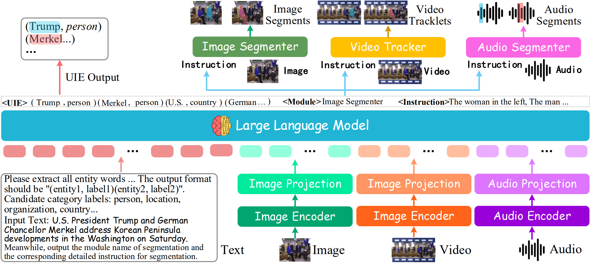

<h1 align="center">
Recognizing Everything from All Modalities at Once: Grounded Multimodal Universal Information Extraction
</h1>

**ACL (Findings) 2024**

[Meishan Zhang](https://zhangmeishan.github.io/), [Hao Fei](http://haofei.vip/)*, [Bin Wang]()
, [Shengqiong Wu](https://chocowu.github.io/), [Yixin Cao](https://sites.google.com/view/yixin-homepage), [Fei Li](https://scholar.google.com/citations?user=AoMmysMAAAAJ&hl=zh-CN), [Min Zhang](https://zhangmin-nlp-ai.github.io/)
(*Correspondence )

<a href='https://haofei.vip/MUIE/'></a>
<a href='https://arxiv.org/pdf/2406.03701'></a> 
<a href='https://haofei.vip/MUIE/#leaderboard'></a>
[](https://youtu.be/mg9ItO6s9V4)


This repository contains the code of Grounded MUIE, **REAMO**.

----------


## Abstract

In the field of information extraction (IE), tasks across a wide range of modalities and their combinations have been traditionally studied in isolation, leaving a gap in deeply recognizing and analyzing cross-modal information. To address this, this work for the first time introduces the concept of grounded Multimodal Universal Information Extraction (MUIE), providing a unified task framework to analyze any IE tasks over various modalities, along with their fine-grained groundings. To tackle MUIE, we tailor a multimodal large language model (MLLM), REAMO, capable of extracting and grounding information from all modalities, i.e., 'recognizing everything from all modalities at once'. REAMO is updated via varied tuning strategies, equipping it with powerful capabilities for information recognition and fine-grained multimodal grounding. To address the absence of a suitable benchmark for grounded MUIE, we curate a high-quality, diverse, and challenging test set, which encompasses IE tasks across 9 common modality combinations with the corresponding multimodal groundings. The extensive comparison of REAMO with existing MLLMs integrated into pipeline approaches demonstrates its advantages across all evaluation dimensions, establishing a strong benchmark for the follow-up research. 

----------

## Method

REAMO MLLM consists of three main parts: multimodal encoder, LLM, and decoder for UIE prediction & multimodal grounding:

- **Multimodal Encoding**: leverage the [ImageBind](https://github.com/facebookresearch/ImageBind) as a unified multimodal encoder. Then, via a projection layer, different input representations are aligned into language-like embeddings that are understandable to the LLM.

- **LLM Reasoner**: use the [Vicuna-v1.5](https://huggingface.co/lmsys/vicuna-7b-v1.5) as the backbone LLM.

- **MUIE Decoding with Grounding**: utilize [SEEM](https://github.com/UX-Decoder/Segment-Everything-Everywhere-All-At-Once) for image segmentation and video tracking, and [SHAS](https://github.com/mt-upc/SHAS/) for audio segmentation.
  
  

----------

## Data Preparation

We leverage three groups of data for training and evaluating:

- Datasets for Alignment Learning: [CC3M](), [Webvid](), and [Audiocaps]().
- Datasets for Cross-modal Grounding-aware Tuning: [MSCOCO](), [Tao](), and [SpeechNER]()
- Datasets for Specific Tasks Learning: [PASCAL-C](https://github.com/bethgelab/robust-detection-benchmark), [VRD](https://cs.stanford.edu/people/ranjaykrishna/vrd/), [imSitu](http://imsitu.org/), [ACE2005](http://projects.ldc.upenn.edu/ace/), [ReTACRED](https://github.com/gstoica27/Re-TACRED), [VidSitu](https://vidsitu.org/), [Twt17](https://github.com/jefferyYu/UMT), [MNRE](https://github.com/thecharm/MNRE), and [M2E2](https://github.com/limanling/m2e2).

----------

## Installation

Please first clone the repo and install the required environment, which can be done by running the following commands:

```
conda env create -n reamo python=3.8

conda activate reamo

# CUDA 12.1
conda install pytorch==2.1.2 torchvision==0.14.1 torchaudio==0.13.1 pytorch-cuda=11.6 -c pytorch -c nvidia

git clone https://github.com/scofield7419/MUIE-REAMO.git
cd MUIE-REAMO

pip install -r requirements.txt
```

----------

## Training

Firstly, you need to modify the parameter, `DATASET_NAME_LIST` to determine the dataset used for training and fine-tuning.
Then, run the command for training and fine-tuning:

```
# for alignment learning
bash pretrain.sh

# for Fine-grained Cross-modal Grounding-aware Tuning and Invocation-based Meta-response Tuning.
bash fine-tune.sh
```

----------

## Predicting

Firstly, you need to prepare the checkpoint, and adjust the following two parameters:
`model_base`: the checkpoint path for base model. 
`model_path`: the checkpoint path for fine-tuned parameters.
Then, run the command to get the prediction:

```
python predict.py
```

----------

## Citation

```
@inproceedings{Zhang00W0LZ24,  
  author       = {Meishan Zhang and  
                  Hao Fei and  
                  Bin Wang and  
                  Shengqiong Wu and  
                  Yixin Cao and  
                  Fei Li and  
                  Min Zhang},  
  title        = {Recognizing Everything from All Modalities at Once: Grounded Multimodal Universal Information Extraction},  
  booktitle    = {Findings of the ACL},  
  pages        = {14498--14511},  
  year         = {2024}  
}  
```

----------

## Acknowledgement

Our code is based on the respective official repositories, [NExT-GPT](next-gpt.github.io), [SEEM](https://github.com/UX-Decoder/Segment-Everything-Everywhere-All-At-Once), and [SHAS](https://github.com/mt-upc/SHAS/). We fully thank the authors to release their code.
